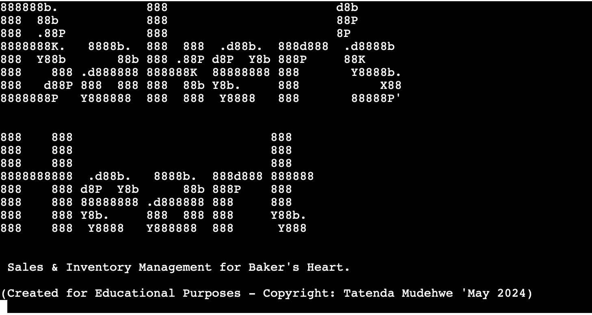

# **Baker's Heart**

 

Baker's Heart is a Python command line interface (CLI) application designed for efficient sales and inventory management in a bakery setting. It allows users to view, add, and update sales and stock data, ensuring accurate tracking of inventory levels. The application provides detailed tabulated views of sales and stock, calculates surplus data for better waste management, and checks for low stock to prevent shortages. With features to manage ingredients, the program enhances operational efficiency. The ASCII art logos and typing effect enhance user interaction, making the application user-friendly and visually appealing.

View the live application here: [Baker's Heart](https://bakers-heart-b9b8b5bfd9a7.herokuapp.com/)  

Google Sheets Sales, surplus, stock and Inventory Data (view only) [here.](https://docs.google.com/spreadsheets/d/17wg0BMZQo8cI_MWcDCm8S6tk35mrxapXJOLnCT-UnFo/edit#gid=1071172766)

## Contents
* [**User Experience/User Interface (UX/UI)**](#user-experienceuser-interface-uxui)
  * [User Goals](#user-goals)
  * [User Stories](#user-stories)
* [**Creation process**](#creation-process)
  * [Project Planning](#project-planning)
  * [Flowchart](#flowchart)
  * [Google API SetUp](#google-api-setup)
  * [Python Logic](#python-logic)
  * [Data Model - Google Sheets](#data-model---google-sheets)
  * [Design Choices](#design-choices)
* [**Features**](#features)
  * [How to Use BakeStock](#how-to-use-bakestock)
  * [Future Features](#future-features)
* [**Technologies Used**](#technologies-used)
* [**Libraries & Packages**](#libraries--packages)
* [**Testing**](#testing)
* [**Creation & Deployment**](#creation--deployment)
* [**Credits**](#credits) 

¨¨¨¨¨¨¨¨¨¨¨¨¨¨¨¨¨¨¨¨¨¨¨¨¨¨¨¨¨¨¨¨¨¨¨¨¨¨¨¨¨

Welcome,

This is the Code Institute student template for deploying your third portfolio project, the Python command-line project. The last update to this file was: **March 14, 2023**

## Reminders

- Your code must be placed in the `run.py` file
- Your dependencies must be placed in the `requirements.txt` file
- Do not edit any of the other files or your code may not deploy properly

## Creating the Heroku app

When you create the app, you will need to add two buildpacks from the _Settings_ tab. The ordering is as follows:

1. `heroku/python`
2. `heroku/nodejs`

You must then create a _Config Var_ called `PORT`. Set this to `8000`

If you have credentials, such as in the Love Sandwiches project, you must create another _Config Var_ called `CREDS` and paste the JSON into the value field.

Connect your GitHub repository and deploy as normal.

## Constraints

The deployment terminal is set to 80 columns by 24 rows. That means that each line of text needs to be 80 characters or less otherwise it will be wrapped onto a second line.

---

Happy coding!
