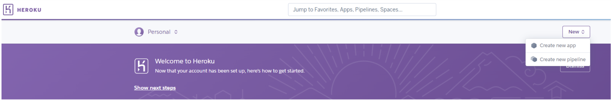
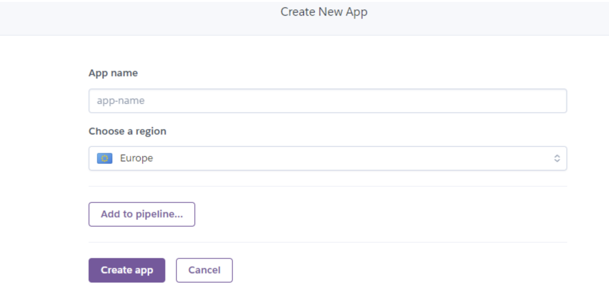

# **Baker's Heart**

 

Baker's Heart is a Python command line interface (CLI) application designed for efficient sales and inventory management in a bakery setting. It allows users to view, add, and update sales and stock data, ensuring accurate tracking of inventory levels. The application provides detailed tabulated views of sales and stock, calculates surplus data for better waste management, and checks for low stock to prevent shortages. With features to manage ingredients, the program enhances operational efficiency. The ASCII art logos and typing effect enhance user interaction, making the application user-friendly and visually appealing.

View the live application here: [Baker's Heart](https://bakers-heart-b9b8b5bfd9a7.herokuapp.com/)  

Google Sheets Sales, surplus, stock and Inventory Data (view only) [here.](https://docs.google.com/spreadsheets/d/17wg0BMZQo8cI_MWcDCm8S6tk35mrxapXJOLnCT-UnFo/edit#gid=1071172766)

## Contents
* [**User Experience/User Interface (UX/UI)**](#user-experienceuser-interface-uxui)
  * [User Goals](#user-goals)
  * [User Stories](#user-stories)
* [**Creation process**](#creation-process)
  * [Project Planning](#project-planning)
  * [Flowchart](#flowchart)
  * [Google API SetUp](#google-api-setup)
  * [Python Logic](#python-logic)
  * [Data Model - Google Sheets](#data-model---google-sheets)
  * [Design Choices](#design-choices)
* [**Features**](#features)
  * [How to Use Baker's Heart](#how-to-use-baker's Heart)
  * [Future Features](#future-features)
* [**Technologies Used**](#technologies-used)
* [**Libraries & Packages**](#libraries--packages)
* [**Testing**](#testing)
* [**Creation & Deployment**](#creation--deployment)
* [**Credits**](#credits) 

# User Experience/User Interface (UX/UI)  
  
## User Goals
1. Accurate Sales Tracking:
   Enter and view sales data to monitor product performance and identify trends.
2. Efficient Inventory Management:
   Add, view, and update stock data to keep track of inventory levels and ensure adequate stock.
3. Surplus Calculation:
   Calculate and view surplus data to manage waste effectively and optimise production.
4. Ingredient Management:
   Manage the inventory of ingredients by adding new items, updating quantities, and deleting outdated items.
5. User-Friendly Interface:
   Interact with the system through an intuitive command line interface enhanced with ASCII art logos and typing effects for a pleasant user experience.

## User Stories 
These user stories aim to cover the essential functionalities required for managing the inventory and sales data of Baker's Heart effectively.

1. As a bakery manager, I want to view the current inventory levels, so that I can check the availability of ingredients.

2. As a bakery manager, I want to add new ingredients to the inventory, so that I can keep track of all the ingredients we have in stock.

3. As a bakery manager, I want to update the quantity of existing ingredients, so that the inventory reflects the actual stock levels after purchases or usage.

4. As a bakery manager, I want to delete ingredients from the inventory, so that obsolete or unused items do not clutter the inventory list.

5. As a bakery manager, I want to view sales data, so that I can analyse the sales performance of different products.

6. As a bakery manager, I want to add new sales data, so that I can keep the records up to date with the latest sales figures.

7. As a bakery manager, I want to compare sales data with stock levels, so that I can identify surplus or shortage of ingredients.

8. As a bakery manager, I want to update ingredient names and quantities, so that any changes or corrections can be made accurately.

9. As a bakery manager, I want the system to validate the data I enter, so that errors are minimised, and the data integrity is maintained.

10. As a bakery manager, I want a clear and simple user interface, so that I can easily navigate through different menus and perform tasks efficiently. 

# Creation Process    
  
## Project Planning  
 As a home baker, I often relied on my notebook to keep track of ingredient inventory, sales, and customer orders. While this worked for small-scale operations, it became increasingly cumbersome as my business grew. I imagined how a digital system could streamline these processes, making it easier to manage stock, record sales, and fulfil customer orders efficiently. Many other bakers likely face similar challenges, struggling with the manual recording of essential business information. This project aims to develop a comprehensive digital tool that addresses these issues, offering a practical solution for bakers to maintain accurate records, ensure smooth operations, and ultimately, grow their businesses. 

  Project Planning and Use of Lucidchart

To effectively plan and visualise the Baker's Heart project, I utilised [Lucidchart](https://www.lucidchart.com/) to create detailed flowcharts. Lucidchart is a powerful tool that allows for the easy creation of diagrams and flowcharts, making it ideal for mapping out the structure and functionality of the application. Here’s how Lucidchart was instrumental in the planning process:

1. Identifying Key Features:
The first step was to identify the key features the application needed, such as inventory management, sales tracking, and customer order management. Lucidchart allowed me to create a high-level overview of these features, ensuring all essential components were included.

2. Flowchart Creation:
I created flowcharts to detail the process flows within the application. For example, the flowchart for inventory management illustrated how users could add, update, or delete ingredients, and how the system would check for low stock levels.
Another flowchart mapped out the sales process, from recording sales data to comparing sales with stock levels and calculating surplus or deficit.

3. User Interaction Mapping:
Lucidchart helped in visualising user interactions with the system. This included how users would navigate through different menus, input data, and receive feedback from the system.
The flowcharts depicted user paths, making it easier to design a user-friendly interface.

4. Data Flow Diagrams:
Data flow diagrams were created to show how information would move between different parts of the system. This ensured that data integrity was maintained and that all parts of the application were well-integrated.

5. Iterative Design and Feedback:
Using Lucidchart made it easy to update and refine the flowcharts based on feedback and new ideas. This iterative process ensured that the final design was robust and met all the requirements.

By using Lucidchart for planning, I was able to create a clear and organised visual representation of the Baker's Heart project. This not only facilitated better understanding and communication of the project’s scope and functionality but also helped in identifying potential issues early in the design phase, leading to a more efficient development process. 

## Flowchart   
ADD IMAGE

   

## Google API SetUp  
Before writing any function code, it was essential to set up the relevant credentials and API connections. This process is outlined in the Creation & Deployment section. Ensuring security was crucial, especially when connecting a Google Account—created specifically for this project—to access the Google Sheets worksheet. Careful steps were taken to prevent sensitive files, such as CREDS.json, from being exposed publicly. The setup of these authorisations and credentials was guided by the Code Institute's Full Stack Software Development course.

Google Sheets was used to store user data, which was accessed, manipulated, and updated as needed. It functioned as a simulated database, ensuring that users would not directly interact with the actual worksheets. Instead, all data entry and manipulation occurred within the terminal. 

Clear instructions are provided in the terminal to guide the user on how to enter data correctly. These instructions ensure that the data is displayed accurately in the output, adhering to the scope and requirements of the project. The terminal prompts are designed to be user-friendly, making the data entry process straightforward and minimising the chances of errors. This approach ensures that the user can interact with the system efficiently, and that the data entered is properly formatted and processed within the project's framework. 

## Python Logic 
For Baker's Heart, I adopted a similar approach to ensure a seamless and functional application. The primary objective was to create a system that accessed, displayed, and edited data from Google Sheets, effectively simulating a database. Recognising the limits of my knowledge with the gspread library, I continually adjusted the scope.

I started by developing simple functions to guide user input through the application. Using if/elif statements, I constructed menus and employed while loops and try/except blocks to validate user input, ensuring robust error handling and user guidance.

From these basic menus, I built smaller functions to manage the flow and manipulation of data. The enumerate() function was particularly useful in pulling data from specific matched locations in the worksheets, ensuring that user input was validated and accurately reflected in the data. Regular testing of these validation functions was critical to maintaining the integrity of the application.

Once a section of the application was confirmed to function correctly, I explored the potential for code reuse in other sections with similar requirements. This approach helped streamline development and maintain consistency. However, some sections required personalised code, especially concerning data display. For instance, I used the Python zip() function for parallel iteration when displaying Inventory data.

By employing these strategies, I ensured that Baker's Heart remained a functional, user-friendly application, effectively simulating a real-world database interaction through Google Sheets.

   

## Data Model - Google Sheets
The user data is inputted into the respective Google Sheets worksheets. Each worksheet is accessible only by me as the Editor, but a View-only link will be provided to demonstrate the data distribution for the project. [Google Worksheets](https://docs.google.com/spreadsheets/d/17wg0BMZQo8cI_MWcDCm8S6tk35mrxapXJOLnCT-UnFo/edit#gid=1071172766)

- Sales Worksheet: Stores detailed records of all sales data entered by the user, ensuring accurate tracking and analysis of sales performance.
 

- Stock Worksheet: Maintains current stock levels, allowing for real-time monitoring and management of inventory.

- Surplus Worksheet: Records surplus data, indicating the difference between stock and sales to help manage waste and production needs.
!Surplus data](/documentation/readme/surplus_data.png)

- Inventory Worksheet: Lists all ingredients along with their quantities, facilitating efficient inventory management and restocking. 
!Inventory data](/documentation/readme/inventory_data.png)

Design Choices
*****EDIT*******

# Features

## How to Use Baker's Heart
Navigating to the Main Menu and Using Baker's Heart

Navigating to the Main Menu:
- Start the Application:
    Launch the Baker's Heart application in your terminal. The program will begin with a welcome screen displaying the Baker's Heart logo and a brief introduction.

    Proceed to the Main Menu:
    After the welcome screen, you will be directed to the Main Menu. This menu serves as the central hub for navigating the application's features.

### Main Menu 

Using the Main Menu:

The Main Menu presents three primary options, each corresponding to a specific aspect of the Baker's Heart application:

    Sales Menu:
        Select this option by entering '1' and pressing Enter.
        This menu allows you to view sales data, add new sales records, and compare sales data with stock levels.

    Ingredients Inventory:
        Select this option by entering '2' and pressing Enter.
        Here, you can view the current inventory, manage ingredients (add, delete, or update), and check for low stock alerts.

    Exit:
        Select this option by entering '3' and pressing Enter.
        This will terminate the application, displaying a goodbye message before exiting.

     

### Sales Menu 

Sales Menu:

1. View Sales Data: Displays and edit sales data in a tabulated format.
2. Add Stock Data: Displays and edit sales data in a tabulated format.
3. View Sales vs Stock: Compares sales data with stock levels, calculating and displaying any surplus.
4. Return to main menu:

### Using the sales menu
        
At the Main Menu, type '1' and press Enter to navigate to the Sales Menu.
The Sales Menu provides several options for managing and viewing your sales data:

   #### View Sales Data Menu
        Select this option by entering '1' and pressing Enter.
        This menu provides sub-options menu view, add, and return to sales data menu.

    1. View sales data:
        This will display the current sales data in a tabulated format, showing details such as item names, quantities sold, and dates.

        After viewing the sales data, you will have the option to add new sales data.
            If you choose to add new sales data, you will be prompted to enter sales figures for five items followed by a date (e.g., 10,20,30,40,50,01/01/2024).
            The new sales data will be added to the sales worksheet, and you will return to the Sales Data Menu.
            Press Enter to return to the Sales Data Menu after viewing the sales data.

    2. Add Sales Data:
        Select this option by entering '2' and pressing Enter.
        You will be prompted to enter sales figures for five items followed by a date (e.g., 10,20,30,40,50,01/01/2024).
        The new sales data will be validated and added to the sales worksheet.
        After successfully adding the sales data, you will return to the Sales Data Menu.

    
    3. Return to sales data menu:
       Select this option by entering '3' and pressing Enter.
        This will take you back to the sales data Menu.

   #### View Stock Data Menu
    In the Sales Menu, type '2' and press Enter to view the stock data.
    This menu provides sub-options menu view, add, and return to stock data menu.

    1. Viewing Current Stock Data:
    Once you select to view the stock data, the application will display the current stock data in a neatly formatted table. The table will show details such as item names and quantities in stock.
 
 
    After viewing the stock data, you will be prompted with an option to add new stock data.
    If you wish to add new stock data, type 'y' and press Enter. If you do not wish to add new stock data, type 'n' and press Enter to return to the Stock Data Menu.

    2. Adding New Stock Data:

    If you choose to add new stock data, you will be prompted to enter stock figures for five items followed by a date.
    Enter the data in the following format: quantity1,quantity2,quantity3,quantity4,quantity5,date (e.g., 100,200,300,400,500,01/01/2024).

   3. Returning to the Stock Data Menu:

    After successfully adding the new stock data, you will be returned to the Stock Data Menu.
    Press Enter to return to the Stock Data Menu after viewing or adding stock data.

  #### View Sales vs Stock Menu
    View Sales vs Stock:
        Select this option by entering '3' and pressing Enter.
        This option compares sales data with stock data to calculate surplus for matching dates.
        The surplus data will be displayed in a tabulated format, showing the difference between stock and sales for each item on matching dates.
        If no matching dates are found, an appropriate message will be displayed.
        Press Enter to return to the Sales Menu after viewing the sales vs stock data.
 

    Return to Main Menu:
        Select this option by entering '4' and pressing Enter.
        This will take you back to the Main Menu.

### Ingredients Inventory Menu

Ingredients Inventory:

View Inventory: Shows the current inventory list with ingredient names and quantities.
Manage Inventory: Provides sub-options to add, delete, or update ingredients.
1. View Inventory: Inventory is displayed.
2. Manage Inventory : Modify the inventory.
3. Return to main menu:

### Using Ingredients Inventory menu

#### View Inventory:
Select this option by entering '1' and pressing Enter.
This will display the current inventory list, showing ingredient names and quantities in a tabulated format.
Press Enter to return to the Inventory Menu after viewing the inventory.

#### Manage Inventory:
Select this option by entering '2' and pressing Enter.
This menu provides sub-options menu to add, delete, or update ingredients in your inventory.

    1. Add New Ingredient:
            Enter '1' to add a new ingredient.
            You will be prompted to enter the name of the new ingredient. Ensure the name contains only alphabetic characters and allowed symbols ((), []).
            Next, enter the quantity of the new ingredient as a number.
            The new ingredient will be added to the inventory, and the updated inventory list will be displayed.
            You can choose to add another ingredient or return to the Manage Inventory menu.

    2. Delete Ingredient:
            Enter '2' to delete an ingredient.
            You will be prompted to enter the name of the ingredient you wish to delete.
            If the ingredient is found, it will be removed from the inventory, and the updated inventory list will be displayed.
            If the ingredient is not found, an alert will be displayed, and you will be prompted to try again.
            You can choose to delete another ingredient or return to the Manage Inventory menu.

    3. Update Ingredient Name or Quantity:
            Enter '3' to update an ingredient.
            You will be prompted to enter the name of the ingredient you wish to update.
            If the ingredient is found, you can enter a new name (or leave blank to keep the current name) and a new quantity (or leave blank to keep the current quantity).
            The ingredient details will be updated, and the updated inventory list will be displayed.
            If the ingredient is not found, an alert will be displayed, and you will be prompted to try again.
            You can choose to update another ingredient or return to the Manage Inventory menu.

#### Return to Main Menu:
    Select this option by entering '3' and pressing Enter.
    This will take you back to the Main Menu.

### Using Exit:
        Selecting this option will end the application. Ensure you have saved any changes before exiting.

By following these steps, you can effectively navigate and utilise the Baker's Heart application to manage sales and inventory efficiently.

### Error Handling and Clear 

    Input Validation:
        The program extensively validates user input to ensure it meets the required format and criteria.
        For instance, when entering sales data, the program checks if the input contains five numbers followed by a date in the correct format. If the input is invalid, an error message is displayed, and the user is prompted to try again.

    Try/Except Blocks:
        The program uses try/except blocks to handle potential errors gracefully. For example, when converting input values to integers, if the conversion fails, the program catches the error and provides a clear error message to the user.

    Clear Error Messages:
        Whenever an error occurs, the program provides clear and specific error messages. This helps users understand what went wrong and how to correct their input.

   Clear Screen Function:
    The clearScreen() function is used to clear the terminal screen before displaying new content. This helps maintain a clean and organised display, making it easier for users to focus on the current task.
    The function is called at the beginning of each menu or sub-menu to ensure that previous outputs and inputs are cleared.

-----  

 

## Future Features  

Batch Management and Tracking:
Introduce batch management features to track production batches, expiry dates, and batch-specific sales.

Inventory Alerts and Notifications:
 Add automated alerts and notifications for low stock levels, upcoming expiration dates, or reorder points. Allow users to set custom thresholds for notifications, ensuring timely restocking and reducing waste.

Enhanced Reporting and Analytics:
Introduce detailed reporting features that generate visual charts and graphs for sales, stock levels, and inventory trends.

# Technologies Used 
 HTML5: Provided within the Code Institute's [Python Essentials template](https://github.com/Code-Institute-Org/python-essentials-template) to ensure a standardised structure and presentation.

JavaScript: Included within the same template to enable dynamic and interactive elements.

Python: All Python code was authored by me, except where noted in the source code or the Credits section below, showcasing my ability to build functional and logical scripts.

[Lucidchart](https://www.lucidchart.com/pages/): Used to design the flowcharts necessary for project planning, aiding in visualising the workflow and processes.

[GitHub](https://github.com/): Used to host the program's source code, facilitating version control and collaborative development.

[Gitpod](https://www.gitpod.io/): Utilised as the development environment for coding and testing the program, providing an integrated workspace.

Git: Implemented for version control, ensuring the ability to track changes, manage branches, and collaborate efficiently.

[Google Sheets](https://docs.google.com/spreadsheets/) : Used for storing, editing, and retrieving user data, simulating a database environment for the application.

[Google Cloud Platform](https://cloud.google.com/): Provided the APIs necessary for connecting the data sheets with the Python code, enabling seamless data manipulation.

[Heroku](https://heroku.com/apps): Used to deploy the project, making it accessible online and allowing real-time interaction.

[PEP8 Validator](https://pep8ci.herokuapp.com/#): Used to validate the Python code, ensuring adherence to coding standards and best practices.

   

# Libraries & Packages 

gspread: This library is used to interact with Google Sheets, allowing the application to read, write, and manage data stored in Google Sheets as if they were a database. It facilitates seamless integration between the Python application and Google Sheets.

google.oauth2.service_account: Specifically, the Credentials class from this module is utilised to handle authentication. It provides secure access to the Google Sheets API by managing the OAuth 2.0 credentials required for accessing the user's Google Sheets.

time: The time library is used to add delays in the text display, enhancing the user experience by simulating a typing effect. This creates a more interactive and engaging interface.

sys: This library is used to manipulate the Python runtime environment, particularly for controlling text output in the terminal. It supports the implementation of the typing effect for text display.

os: The os library provides a way to interact with the operating system, specifically to clear the terminal screen. This helps in maintaining a clean and user-friendly interface by removing previous outputs when navigating through menus.

pandas: Pandas is a powerful data manipulation library that is used to convert data from Google Sheets into DataFrames. This enables easy handling, processing, and display of data in tabulated formats, making it simpler to manage and analyse the data.

tabulate: This library is used to format the DataFrame outputs into neatly aligned tables in the terminal. It improves the readability of the data by displaying it in a structured grid format, which is particularly useful for viewing sales and stock data.

# Testing
I have created a separate file for my Manual Testing and Validation. It can be found here:[TESTING.md](/TESTING.md)

# Creation & Deployment  
The following steps for creating and configuring a new Python workspace and API credentials have been informed by and adapted from the Python walkthrough project 'Love Sandwiches' by [Code Institute's](https://codeinstitute.net/ie/). Please ensure each step is applicable to your project requirements and adjust the provided data accordingly.

### Creating a new repository 

Steps to create a new repository.
  
The [Code Institute's Python Essential Template](https://github.com/Code-Institute-Org/python-essentials-template) was used to create a terminal for my Python file to generate it's output. 

To utilize this template, adhere to these steps:
1. Sign in to [GitHub](https://github.com/) or register for a new account.
2. Go to the Python template repository provided above.
3. Select '**Use this template**' -> '**Create a new repository**'.
4. Pick a new repository name and choose '**Create repository from template**'.
5. Within your new repository area, click the green '**Gitpod**' button to create a new workspace.

 
  
-----  
### Activating the Google Drive & Sheets API

Steps to activate the APIs

To access the data in a Google Sheets worksheet using Python code, an API is required. Please follow these steps to set up your APIs: 

1. Go to the [Google Cloud Platform](https://cloud.google.com), using your email address/Google account that is registered to you alone.
2. On the Google Cloud Platform Dashboard, create a new project by clicking the '**Select a Project**' button and choosing the '**New Project**' option. Provide a name for your new project and click '**Create**'. (Since access credentials are unique to each project, create a new project for every project you build.)
3. Click on '**Select Project**' in the blue banner to access your project page.
4. From the left side menu, select '**APIs and Services**', then choose '**Library**'.
5. Utilise the search bar to find the two APIs required for this project: Google Drive API and Google Sheets API. For each API, select it from the search results and click '**Enable**' on its main page. Follow the steps provided for the Google Drive API, but only enable the Google Sheets API by clicking '**Enable**'. There's no need to download credentials again for the Google Sheets API.
6. On the API overview page, click on '**Create Credentials**' to generate credentials allowing access to your Google Drive from your Python code.
7. Complete the form fields and dropdown menus with project-specific information. For instance, select **Google Drive API -> Application Data -> No, I'm not using them** if not using Kubernetes, App Engine, etc.
8. Under Service Account Details, assign a Service Account name and click '**Create**'.
9. From the Role Dropdown menu, choose **Basic -> Editor**, then click '**Continue**'. If it's a personal project and you don't need to grant users access to the service account, click '**Done**' to finish the form.
10. On the next page, click on your newly created Service Account, then navigate to the '**Keys**' tab and select '**Add Key**'. Choose '**Create New Key**'.
11. Select JSON and click '**Create**'. Your JSON file containing API credentials will be downloaded to your machine.

-----  

### Setting up the Gitpod workspace for the APIs

Steps for workspace setup

1. Within the newly created Gitpod workspace using the Python Essentials template, drag and drop the JSON file generated in the preceding steps into the workspace.
2. Optionally rename it to `CREDS.json`, then open the file. Locate the client_email address you previously entered, and copy it without the surrounding quotes.
3. In the Google Sheets file designated for this project, click '**Share**', paste the email address into the field, select '**Editor**', uncheck '**Notify People**', and click '**Share**'. This grants our project access to the spreadsheet.
4. To prevent the private credentials from being exposed in the cloud, add the `creds.json` file to your `gitignore` file before committing any changes to your repository and pushing them to the cloud.
5. Execute the command `git status` to verify that the `creds.json` file is not staged for commit.

  
  
-----  

### Initial Code for connecting to our API with Python

Steps to including the Python/API connection code

1. At the beginning of the `run.py` file associated with this project, you'll find the necessary code to ensure proper connection with your APIs. It's crucial to provide the exact spreadsheet name to the `SHEET = GSPREAD_CLIENT.opn('your-filename-here')` code to prevent gspread from encountering errors.
2. Use the command `pip3 install gspread google-auth` to install the gspread package for managing worksheet data and the google-auth package for accessing your Google Sheets account using the previously downloaded Credentials. Execute this command in the Gitbash terminal.
3. Please consult the `run.py` file for the import, SCOPE, CREDS, SCOPED CREDS, GSPREAD CLIENT, and SHEET code required to establish API connections. Adjust any personal data in accordance with your project's requirements.

  
-----  

### Deploying to Heroku 
This project has been deployed on Heroku, utilising Python as the backend language. For precise testing, I opted for early deployment on Heroku using Automatic Deployment to update the program whenever new code was pushed to my GitHub repository. Below are the steps I followed to set up my project, with guidance from the [Code Institute's](https://codeinstitute.net/ie/) 'Love Sandwiches' project.

1. Sign in to [Heroku](https://id.heroku.com/login) or create an account if you're a new user.
2. Once logged in, navigate to the '**New**' button at the top right corner of the Heroku Dashboard, and select '**Create New App**'.

Create new app

  

3. Provide an app name and select your region. Then, click '**Create App**'.

Enter app name

  
  
4. In the Deploy tab, navigate to '**Settings**', go to the '**Config Vars**' section, and click '**Reveal Config Vars**'. Here, input KEY:VALUE pairs required for the app's successful operation. Enter `CREDS` as the KEY and paste the content of your `CREDS.json` file as the VALUE. Then, select '**Add**'.
5. Repeat the process with a KEY:VALUE pair of `PORT` and `8000`.
6. In the Settings tab, under the Buildpack section, click '**Add Buildpack**' at the bottom right of the screen. Select the '**Python**' pack first, save changes, then choose the '**NodeJS**' buildpack and save changes. Note: the Python buildpack _must_ be above the NodeJS buildpack.
  

Choose Buildpacks

  
  
7. Proceed to the '**Deploy**' tab and select GitHub as the Deployment method.
8. Search for the repository name, choose the branch you want to build from, and connect it by clicking the '**Connect**' button.
9. Choose either '**Automatic**' or '**Manual**' deployment options; I selected the 'Automatic' deployment method. Then, click '**Deploy Branch**'.
10. Once the app's build waiting period is over, click the '**View**' link to access your newly deployed site.

-----  

### Forking the GitHub Repository

A copy of the original repository can be made through GitHub. Please follow the below steps to fork this repository:  

1. Visit GitHub and sign in.
2. After logging in, access this repository using the following link: [Baker's Heart Repository](https://github.com/Tenda-M/Baker-s_Heart-).
3. Above the file section of the repository and located at the top right of the page, you'll find the '**Fork**' button. Click on it to create a fork of this repository.
4. You should now find a forked version of this repository in your GitHub account.

-----  

### Clone this GitHub Repository

A local clone of this repository can be made on GitHub. Please follow the below steps:
1. Go to GitHub and sign in.
2. You can find the [Baker's Heart Repository](https://github.com/Tenda-M/Baker-s_Heart-) at this address.
3. Above the section containing repository files, locate the '**Code**' button.
4. Click on it and select your preferred cloning method from HTTPS, SSH, or GitHub CLI. Copy the URL to your clipboard using the '**Copy**' button.
5. Launch your Git Bash Terminal.
6. Navigate to the directory where you want the cloned directory to be created.
7. Enter `git clone` followed by pasting the copied URL from step 4.
8. Hit '**Enter**' to initiate the creation of the local clone.

 

# Credits

## Content References
# References

- The gspread Documentation is utilized as a reference and guide for data manipulation between Python and Google Sheets throughout the project: [gspread Docs](https://docs.gspread.org/en/latest/index.html)

- The Code Institute's 'Love Sandwiches' project provides guidance for setting up Google Sheets API and Credentials: [Code Institute](https://codeinstitute.net/ie/)

- W3Schools provided helpful Python tutorials. [W3Schools](https://www.w3schools.com/python/default.asp)

- The Python Typing Text Effect us was from. [computing.net](https://www.101computing.net/python-typing-text-effect/)

- ASCII art was utilised twice in the project and was generated by: [ASCII Today](https://ascii.today/)

## Acknowledgements  
- I extend my heartfelt gratitude to my family for their unwavering support during discussions on ideas and debugging, as well as for diligently testing my work.
- Special thanks to my mentor, Excellence Ilesanmi, for providing invaluable support and guidance throughout this journey.
- I am deeply thankful to my fellow peers at Code Institute for their invaluable support and camaraderie.

[Back to Top](#Baker's Heart)

¨¨¨¨¨¨¨¨¨¨¨¨¨¨¨¨¨¨¨¨¨¨¨¨¨¨¨¨¨¨¨¨¨¨¨¨¨¨¨¨¨
